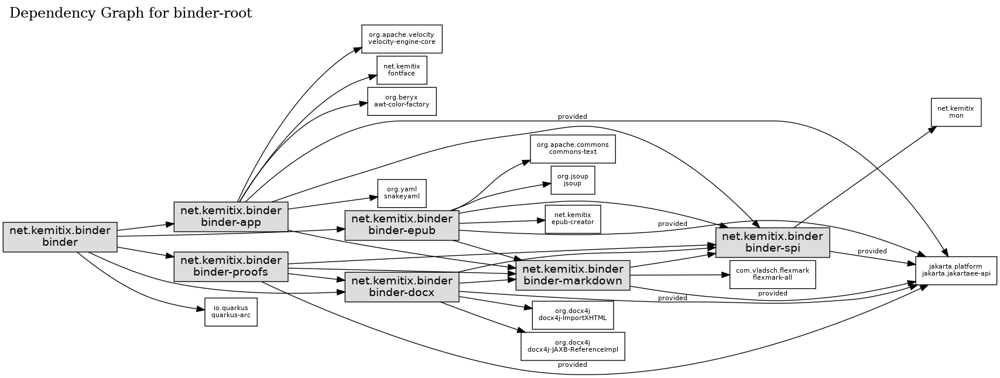

# binder
Create docx and epubs from markdown files for Cossmass Infinities

## Command Line Arguments

* BINDER_DIR - the directory containing the manuscript (i.e. `binder.yaml`)

## Structure and Dependencies

